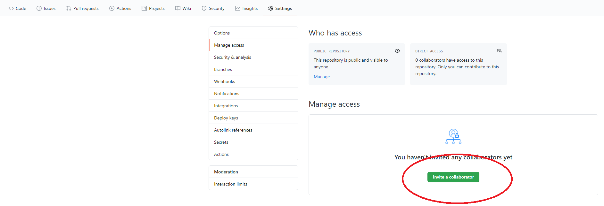

# ASB 2020 GitHub tutorial setup
#### [Ryan Alcantara](https://twitter.com/Ryan_Alcantara_) & [Gary Bruening](https://twitter.com/garebearbru) & [Ross Wilkinson]

This will be the repository that we will use for the Git Tutorial for [ASB 2020](https://asb2020.gatech.edu/)!

We will keep updating this as more things get added.

# Pre-Meeting Setup
This section is intended to take you through the steps required before the meeting. 

There are three things that you need to do BEFORE the tutorial.
1. First you need to create a [Github](https://github.com/) account. Follow the instructions on their page to setup your account.
2. The first program everyone will need is some version of Git. Git is the version control software that allows you to see, track, and edit changes to code bases. 
3. The second program is either [MATLAB](https://www.mathworks.com/) or [Python](https://www.python.org/). We will be using these to run out example scripts.
4. Create one git repository for the group. **Only the group lead needs to do this.**

## 1. Creating a GitHub Account
This should be fairly self explanatory. Go the the GitHub [website](https://github.com/), and create a new account.

## 2. Installing Git
This [website](https://git-scm.com/book/en/v2/Getting-Started-Installing-Git) has more detailed install instructions for all 3 operating systems.

For this tutorial we will be focusing on using Git with [Github](https://github.com/). Github has produced a great desktop application for Windows and Mac that you may want to use.

### Windows
Windows has two options, you can install Git and use the Git Bash application, or you can use the Github desktop application.

To download Git and use the Bash application, go to [this website](https://git-scm.com/download/win) and click the link associated with your version of Windows.
The tutorial will be focused on using the GitBash application, so we highly recommend this.

If you don't want to use GitBash, you can use the desktop application, but we do not recommend this.
To download the Github desktop application, go [here](https://desktop.github.com/) and download the application.

### Mac
With Mac (10.9 and above), you can install Git directly by running the command in terminal
	git --version

You can also install Git through the binary installer, and can be downloaded [here](https://git-scm.com/download/mac).

### Linux
If you're on Fedora or another closely related distribution you should be able to run
	$ sudo dnf install git-all

or if you're on Debian-based, like Ubuntu run
	$ sudo apt install git-all

If these don't work, go to this [page](https://git-scm.com/download/linux) for more information.

## 3. Installing MATLAB/Python
We setup this tutorial to be used with both MATLAB and Python, either should work.
Python however, is free to use and download while MATLAB will require a license. Most universities provide students licenses.

### MATLAB
These scripts were built in MATLAB 2019b, but we do not believe you need this specific version installed.
Any recent version should work with our code.
To download MATLAB go [here](https://www.mathworks.com/downloads/). 

### Python
We will be using Python 3.6 with the Anaconda distribution. This is a large package that includes many of the base functions and IDE's that are very common to Python.

To download the Anaconda distribution, go [here](https://www.anaconda.com/products/individual) and choose your installer near the bottom. Anaconda comes with a few possible IDE's, we prefer VScode but you can use whichever to edit the scripts and run them.

# ONLY DO THIS IF YOU'RE ASSIGNED GROUP LEADER
## 4. Creating the Git Repository for your group.
This section should cover how the group leader will download the repository, create their own version of it, and then invite their group members (collaborators) to the project. Only one person per group needs to do this.

### a. Download the repo in .zip format.
First, download the current repo in a .zip format. Go the the primary repository [here](https://github.com/alcantarar/ASB_Tutorial), then near the top right of the window click the green button with "Code" on it. Then select **Download ZIP**. Extract this zip file to somewhere on your computer.

### b. Create a repository on your Github account.
To create a new repository in your Github account, click the button in the very top left of this window (green circle), then near there click **New** (red circle).

Title this 'ASB_Tutorial_Example', and make sure the repository is public. 
Additional help may be found [here](https://docs.github.com/en/enterprise/2.13/user/articles/creating-a-new-repository).

### c. Add the files to the repository.
Now navigate to this new repository in your account and add the files. Near the Code button used before, there will be an add file button. Select this, and add the folder from before. 

### d. Add collaborators to the project.
Last, add your group members to the project. As the leader, across the top you'll have an extra button called "Settings". Click this, then Manage Access, then add collaborators. You can then add your group members by Github account, email, or name.
Additional help can be found [here](https://docs.github.com/en/github/setting-up-and-managing-your-github-user-account/inviting-collaborators-to-a-personal-repository).

Now everyone should be able to see and edit the repository!
