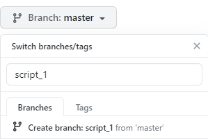
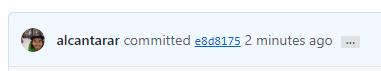

# Breakout Room #1

## Background
You and your collaborators have made a recent discovery that will surely result in winning the prestigious
Nobel Peach Prize, awarded to the group of biomechanists with the best peach-related figure made entirely with 
code! Your team has been working for months and have just a few bugs to fix before submitting the figure to 
Nature for publication. Your team will be able to quickly fix these bugs in parallel thanks to version control.

The code used to generate your figure is comprised of an upper-level script `ASB_Tutorial/main_script.m`, which 
calls five numbered subscripts (e.g. `ASB_Tutorial/subscripts/script_1.m`). The data required to generate your 
figure is stored as CSV files at `ASB_Tutorial/data/`. 

If you need help remembering the git functions, refer to `ASB_Tutorial/git_cheatsheet.md`.

## Objective
Work together to fix the bug in each subscript and generate the figure by running `main_script.m`.

## 1. Organize
#### a. Add collaborators to repository
Elect a project leader that has successfully forked the repository per the pre-tutorial instructions. They will need 
to add each members as collaborators to the repository by following these steps listed here: 
https://docs.github.com/en/github/setting-up-and-managing-your-github-user-account/inviting-collaborators-to-a-personal-repository

#### c. Bug assignment
You will divide and conquer the bugs. There is one bug in each of the five subscripts. Assign each team member a 
subscript to fix. If there are more subscripts than team members, assign multiple subscripts for some members. 

#### d. Create branches
Once subscripts are assigned, each team member should make their own branch of the repository. This allows team 
members to simultaneously make changes to the same script without affecting each other or the script stored in the 
remote (online) repository. Name each branch after the respective subscript(s) that will be fixed. 

1. Navigate to the main page of the repository on www.github.com

2. Click the branch selector menu:    

3. Type in a unique name for your branch (name of subscript(s) to be fixed), then select **Create branch**:    


#### e. Clone repository & your branch
If you're going to be changing code, you need a copy of it on your machine. This is done through a process
called "cloning", where you download a local copy of a remote repository. To do this, you will use Git Bash or Terminal,
depending on your operating system. *This tutorial will refer to Git Bash, but the functions are the same in Terminal.*
 
Open Git Bash and navigate to folder where you want to store the cloned repository:
```
$ cd PATH/TO/FOLDER/
```
Clone repository from github.com to your computer. [URL] is the URL for the **repository of the project leader**, 
where each member is listed as a collaborator. It should be like `https://github.com/USERNAME/ASB_Tutorial`.
```
$ git clone [URL]
```
You now have a copy of the repository located at `PATH/TO/FOLDER/`. Go check it out! You'll see all the files that are 
present on the main page of the repository on GitHub. Now you need to switch to your branch before making any changes to 
files:
```
$ git checkout [BRANCH-NAME]
```
Now you're ready to fix some bugs!

## 2. Making changes to files
#### a. Debug subscript 
This isn't a tutorial on debugging, so the bugs are easy to fix and solutions are commented out at the bottom of each 
subscript. Open MATLAB (or a basic text editor) and fix the bug in your subscript. Save the debugged file (with the 
same filename).
#### b. Commit changes
You made changes to files in the repository and and want these changes to be tracked by Git. Git takes 
"snapshots" called "commits" of your repository files, but you have to tell it 1) which files to include in the commit, 
and 2) when to make the commit and include a message describing the changes in the commit, and 3) update the remote
repository with your local changes. These three steps are performed 
in Git Bash and are outlined below.

##### 1. Tell Git that files have been changed and should be included in the commit. 
Git will compare the current state of the files to their previous state and identify any changes made. Files that have
been changed will be "staged". In the "snapshot" analogy, this step is like wrangling your family members right before 
taking the picture.
```
$ git add .
```
View the files Git has identified as undergoing some changes (lines starting with `>>>` represent a message returned 
upon executing `git status`):
```
$ git status

>>> On branch [BRANCH-NAME]
>>> Your branch is up to date with 'origin/[BRANCH-NAME]'.
>>>
>>> Changes to be commited:
>>>   (use "git reset HEAD <file>..." to unstage)
>>>       modified: script_1.m
```
This returned message tells you a few things:
1. The branch you're working on.
2. It found changes that are staged (the result of `git add .`)
3. How to remove a specific file from being staged (`git reset HEAD [FILENAME]`)
4. Which file was changed. 

##### 2. Tell Git when to make the commit
To continue using the "snapshot" analogy, you need to decide when to take the "snapshot". Ideally, each commit you make
is meaningful, in the sense that a significant change was made to the code. On one end of the spectrum, you could take a 
snapshot after every new character added to your script. On the other end of the spectrum, you could take a snapshot only
once a month. The former provides you with an insanely large number of commits that don't contain enough meaningful changes
to make reverting back to that commit beneficial. The later provides you with only a few commits, but each contains multiple
changes, making identifying a specific change difficult.

In this case, you fixed a bug and this represents a meaningful level of changes made to your script. To help organize
commits, you need to add a message that will be associated with the staged changes. For now, make it short and sweet. For more
information on meaningful commit messages, read [this blog post](https://chris.beams.io/posts/git-commit/) later. Note: 
Git will only commit the *staged* changes.
```
$ git commit -m "[COMMIT MESSAGE GOES HERE IN QUOTATIONS]"
```

##### 3. Update remote repository
So Git has taken a snapshot of your local repository and identified changes made. However, the remote repository stored on 
GitHub hasn't been updated. This is a cool feature of Git because you can make many changes (commits) without internet
access to GitHub because you have a local copy of the repository on your computer! Then, when it's convenient, you can 
send all your commits to the repository on GitHub. This process is called "pushing" commits.
```
git push 
```
Now if you got to the page for your branch on github, you'll see the changes you made locally! To view your branch:

1. Navigate to the main page of the repository on www.github.com

2. Click the branch selector menu and select your branch name from the dropdown menu:    


3. Click on the commit 7-digit identifier to view the changes made:


GitHub will show the line-by-line changes made to the script as well as the commit message.

**Before moving on, make sure all team members have fixed their assigned scripts, staged/committed/pushed their changes, 
and viewed them on GitHub.**

## 3. Merging branches


 


