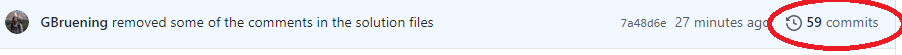
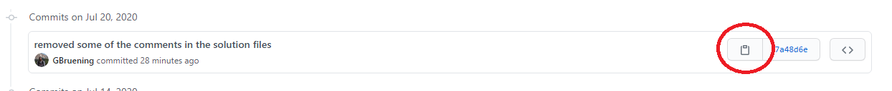

# Breakout 3

Unfortunately, the figure got rejected from the Journal. But fear not! There are other journals to apply to.
You decide that some of the comments made by the previous reviewers did not make sense, and you want to change them back before resubmitting.

## Changes to make
- Change the peaches color to its original color. **_Refer to script 1_**
- Change the leafs color to its original color. **_Refer to script 2_**
- The text for 'Virtual 2020' is to large and overlapping the line. Reduce the text size to 16. **_Refer to script 5_**

## How to Checkout to previous commits
To checkout to a previous commit you need to first find a working commit from before the changes were made, then checkout to that specific commit.

1. To find the commit that you want to go back to, select the branch that the change was made in.

2. Then click the commits text on the right hand side to view all the commits made to that branch.

3. Then in the list find the commit that you want to checkout to, and click the clipboard icon to copy the commit number. This will copy the full commit number to your keyboard.

4. In Git Bash, navigate to the directory, checkout to that branch, and checkout to that commit. 

	`git checkout df52ea2`

5. Then commit this as a new commit.

	`git commit -m 'Revert back to df52ea2` 